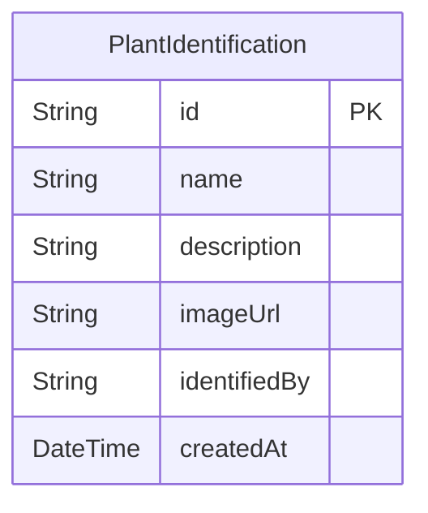

# Registrador Botânico

Registrador Botânico é uma plataforma corporativa de identificação e manejo de plantas. Esta implementação foi refatorada para um monorepo moderno com frontend em React + TypeScript e backend em Node.js + TypeScript usando Clean Architecture.

## Arquitetura

- **Frontend**: React 18 + Vite + TypeScript + Tailwind CSS
- **Backend**: Express + TypeScript + Clean Architecture
- **Persistência**: PostgreSQL + Prisma ORM
- **DevOps**: Docker Compose para desenvolvimento, GitHub Actions para CI/CD
- **Qualidade**: ESLint (Airbnb), Prettier, Vitest/Jest
- **Segurança**: JWT, validação de entrada com Zod, helmet, CORS e tratamento de erros centralizado

## Estrutura do Monorepo

```text
Registrador Botânico/
├─ .github/
│  └─ workflows/
│     └─ ci.yml
├─ backend/
│  ├─ prisma/
│  │  └─ schema.prisma
│  ├─ src/
│  │  ├─ common/
│  │  │  ├─ errors/
│  │  │  │  └─ ApiError.ts
│  │  │  ├─ middleware/
│  │  │  │  ├─ auth.ts
│  │  │  │  ├─ errorHandler.ts
│  │  │  │  └─ notFound.ts
│  │  │  └─ validation/
│  │  │     ├─ schemas.ts
│  │  │     └─ validate.ts
│  │  ├─ modules/
│  │  │  └─ plant/
│  │  │     ├─ domain/
│  │  │     │  ├─ entities/
│  │  │     │  │  └─ PlantIdentification.ts
│  │  │     │  └─ ports/
│  │  │     │     └─ PlantRepository.ts
│  │  │     ├─ infra/
│  │  │     │  ├─ http/
│  │  │     │  │  └─ PlantController.ts
│  │  │     │  └─ prisma/
│  │  │     │     └─ PrismaPlantRepository.ts
│  │  │     └─ usecases/
│  │  │        └─ CreatePlantIdentification.ts
│  │  ├─ app.ts
│  │  └─ server.ts
│  └─ package.json
├─ frontend/
│  ├─ src/
│  │  ├─ components/
│  │  │  ├─ ErrorBoundary.tsx
│  │  │  ├─ PlantIdentifier.tsx
│  │  │  └─ SkeletonCard.tsx
│  │  ├─ lib/
│  │  │  └─ api.ts
│  │  ├─ styles/
│  │  │  └─ globals.css
│  │  ├─ App.tsx
│  │  ├─ main.tsx
│  │  └─ types.ts
│  ├─ package.json
│  ├─ tailwind.config.ts
│  └─ vite.config.ts
├─ .gitignore
├─ docker-compose.yml
└─ .env.example
```

## Setup Rápido com Docker Compose

1. Copie as variáveis de ambiente:

```bash
cp .env.example .env
```

2. Inicie os containers:

```bash
docker compose up --build
```

3. Acesse:

- Frontend: `http://localhost:5173`
- Backend: `http://localhost:4000`

## API

### Autenticação

- `POST /api/auth/login`
  - body: `{ "email": "admin@registradorbotanico.com", "password": "registradorbotanico123" }`
  - retorna: `{ "token": "..." }`

### Identificação de Planta

- `POST /api/plant-identifications`
  - headers: `Authorization: Bearer <token>`
  - body: `{ "name": "Samambaia", "description": "Folhas finas e serrilhadas", "imageUrl": "https://..." }`
  - retorna: dados salvos no banco

## ERD (Diagrama de Entidade-Relacionamento)



## CI/CD (Sugestão)

- `.github/workflows/ci.yml`: lint, test, build e deploy
- Frontend: Vercel
- Backend: Render ou Railway

## Exemplo de Fluxo de Identificação

1. Frontend captura upload e chama `POST /api/plant-identifications`
2. Backend valida com Zod e JWT
3. Use case `CreatePlantIdentification` aplica regras de domínio
4. Repositório Prisma salva no PostgreSQL
5. Frontend exibe resultado ou erro amigável

## Observações

Esta refatoração transforma o projeto estático em um monorepo corporativo com separação de responsabilidades, testes e infra padrão de mercado.
